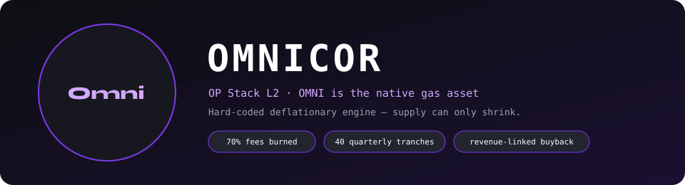
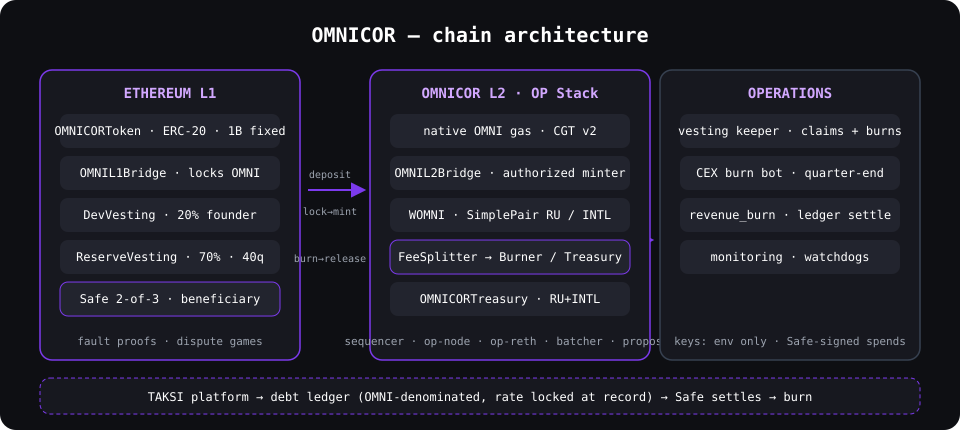
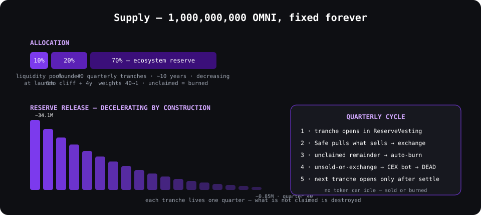
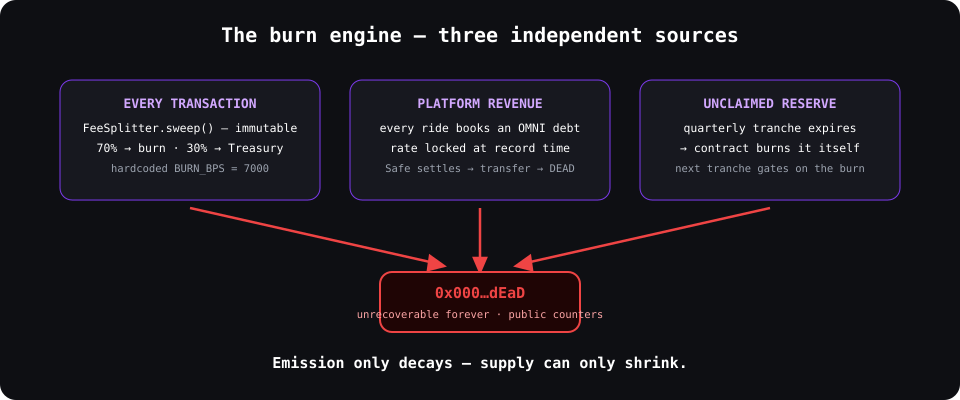

<div align="center">
  <br />
  
</div>

<p align="center">
  <a href="https://github.com/AI-Omnicor/omnicor-public/actions/workflows/contracts.yml"></a>
  
  
  
  
  
</p>

> **Infrastructure project.** OMNICOR is an independent Layer-2 blockchain built on the OP
> Stack, with OMNI as the chain's native gas token (custom gas token, CGT v2). Application-layer
> bridging, deflationary tokenomics enforced by immutable contracts, and a revenue-linked
> burn tied to real platform usage — the TAKSI mobility platform.

## What makes it different

- **70% of every fee is burned.** An immutable `FeeSplitter` routes all protocol fees:
  70% to the dead address, 30% to the Treasury. Hardcoded `BURN_BPS = 7000` — no admin
  path, no governance toggle.
- **Emission that decays and cannot idle.** The 70% ecosystem reserve releases in 40
  quarterly tranches of decreasing size over ~10 years. Each tranche lives one quarter:
  whatever is not claimed is destroyed by the contract itself, and the next tranche cannot
  open until the previous remainder settles.
- **Revenue-linked buyback.** Every platform ride — any currency, any country — books an
  OMNI-denominated obligation in a debt ledger, rate locked at record time. The Safe settles
  the ledger by burning exactly that sum on L1. On-chain verifiable, no trust required.
- **Immutable bridges, no admin keys.** `OMNIL1Bridge` locks ERC-20 OMNI; `OMNIL2Bridge`
  mints native OMNI via the authorized `LiquidityController`. Withdrawals are fault-proven.
  Neither contract can be upgraded or rerouted.
- **Permissionless keepers.** Vesting claims, expired-tranche burns, and fee sweeps run on
  schedulers that can only trigger what the contracts allow — they cannot redirect funds.

## Architecture

<p align="center"></p>

## Tokenomics

<p align="center"></p>

## The burn engine

<p align="center"></p>

## Contracts

| Contract | Layer | Role |
|---|---|---|
| `OMNICORToken` | L1 | ERC-20, 1B fixed supply, minted once |
| `DevVesting` | L1 | 20% founder: 6-month cliff + 4-year linear |
| `ReserveVesting` | L1 | 70% reserve: 40 quarterly tranches, burn-on-expiry |
| `OMNIL1Bridge` / `OMNIL2Bridge` | L1/L2 | Immutable application-layer CGT bridge |
| `FeeSplitter` | L2 | 70% burn / 30% treasury — hardcoded |
| `OMNIBurner` | L2 | Native burn sink → `0x…dEaD` |
| `OMNICORTreasury` | L2 | RU + INTL contours, Safe-owned |
| `WOMNI` · `SimplePair` | L2 | Wrapped OMNI + AMM rehearsal |

Full contract sources: [`contracts/src/`](contracts/src/) —
73 Forge tests in [`contracts/test/`](contracts/test/).

## Documentation

| Document | Contents |
|---|---|
| [`docs/tokenomics.md`](docs/tokenomics.md) | Full tokenomics spec — allocations, burns, quarterly cycle |
| [`docs/audit.md`](docs/audit.md) | Five audit passes — every finding, severity, fix |
| [`docs/integration.md`](docs/integration.md) | External-platform integration surface |
| [`docs/deployments.md`](docs/deployments.md) | Rehearsal deployments and addresses |
| [`docs/production-addresses.md`](docs/production-addresses.md) | Production treasury Safe + role registry |
| [`docs/production-checklist.md`](docs/production-checklist.md) | Pre-launch gate |
| [`docs/ops-runbook.md`](docs/ops-runbook.md) | Operations runbook |
| [`docs/roadmap.md`](docs/roadmap.md) | Delivery roadmap |

## Engineering

```bash
cd contracts && forge test     # 73 tests — vesting, bridge, AMM, splitter, treasury
```

Built on the [OP Stack](https://github.com/ethereum-optimism/optimism) — custom gas token
path (CGT v2), kona-based fault proofs, op-reth execution.

## License

MIT — same license as the OP Stack upstream.
